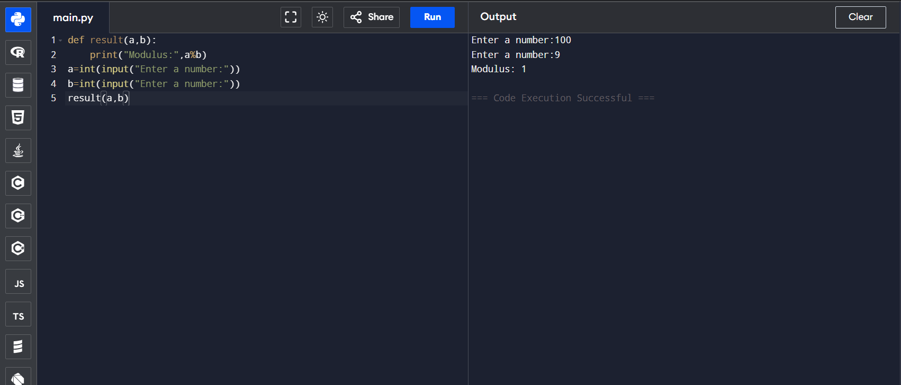

# Functions in Python: Modulo Calculator

## 🎯 Aim
To write a Python program that defines a function which accepts two values and returns their **modulo** using the `%` operator.

## 🧠 Algorithm
1. Define a function called `result` that takes two arguments `a` and `b`.
2. Inside the function, compute the modulo using `a % b`.
3. Print the result of the modulo operation.
4. Get two integer inputs from the user.
5. Call the `result` function with the user-provided values.

## 🧾 Program
```
def result(a,b):
    print("Modulus:",a%b)
a=int(input("Enter a number:"))
b=int(input("Enter a number:"))
result(a,b)
```


## Output

## Result
Hence the program is executed and the output is verified