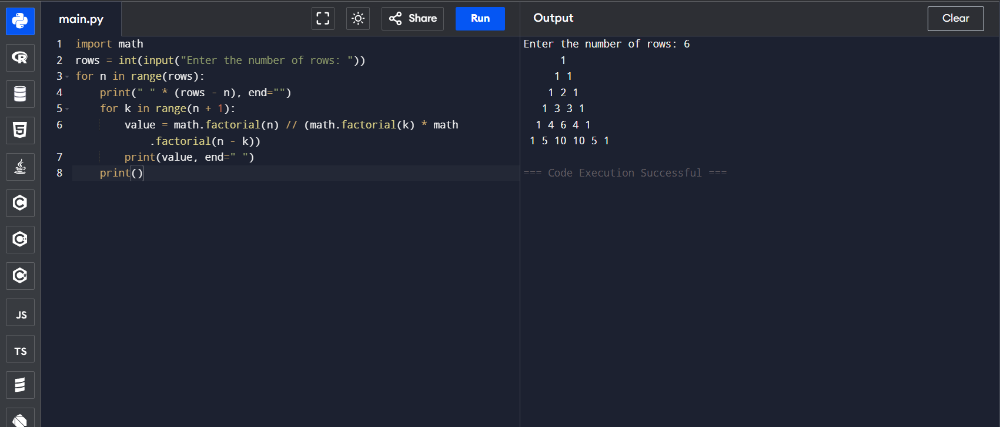

# 🔺 Looping(Patterns)-Pascal's Triangle Generator in Python

This project demonstrates a simple Python program to generate **Pascal’s Triangle**, where the number of rows is provided by the user.

## 🎯 Aim

To write a Python program that generates **Pascal's Triangle** using numbers. The number of rows is accepted from the user.

## 🧠 Algorithm

1. Start the program.
2. Input the number of rows from the user.
3. Loop from 0 to the number of rows.
4. For each row:
   - Print appropriate spaces to shape the triangle.
   - Compute values using the formula:  
     \[
     C(n, k) = \frac{n!}{k!(n-k)!}
     \]
5. Print all rows of Pascal’s Triangle.
6. End the program.

## 🧪 Program
```
import math
rows = int(input("Enter the number of rows: "))
for n in range(rows):
    print(" " * (rows - n), end="")
    for k in range(n + 1):
        value = math.factorial(n) // (math.factorial(k) * math.factorial(n - k))
        print(value, end=" ")
    print()
```

## Sample Output

## Result
Hence the program is executed and the output is verified
